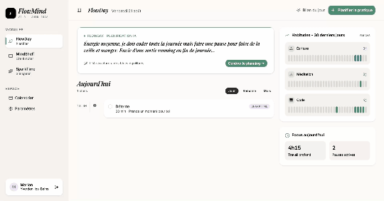
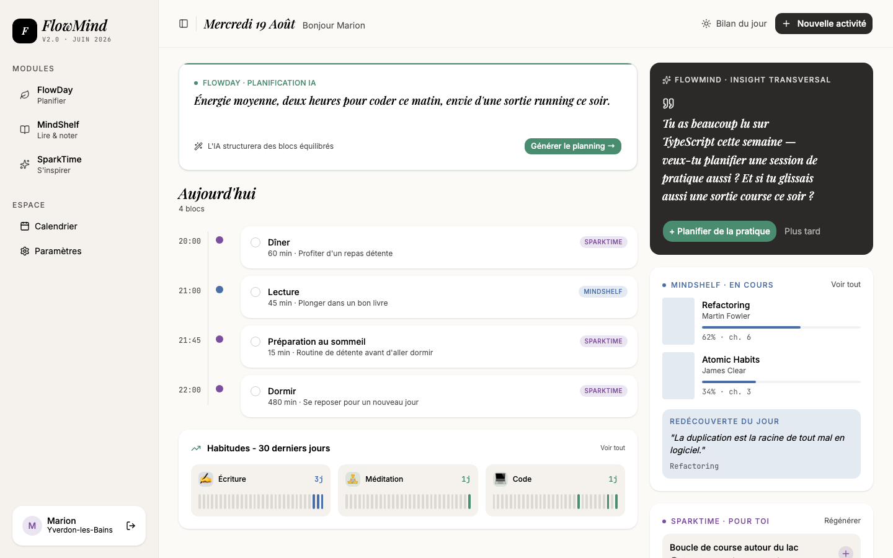
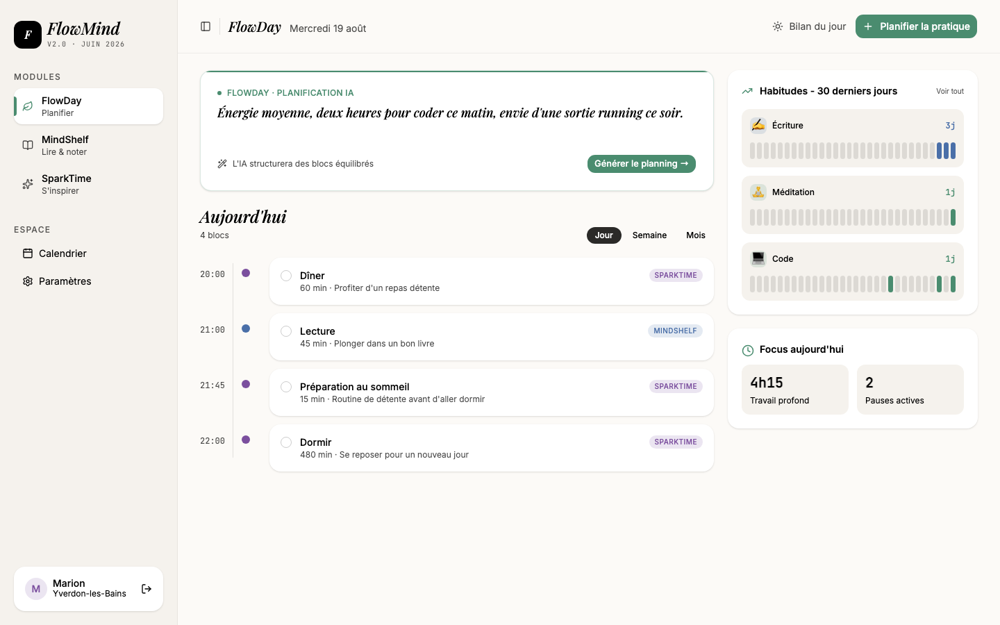
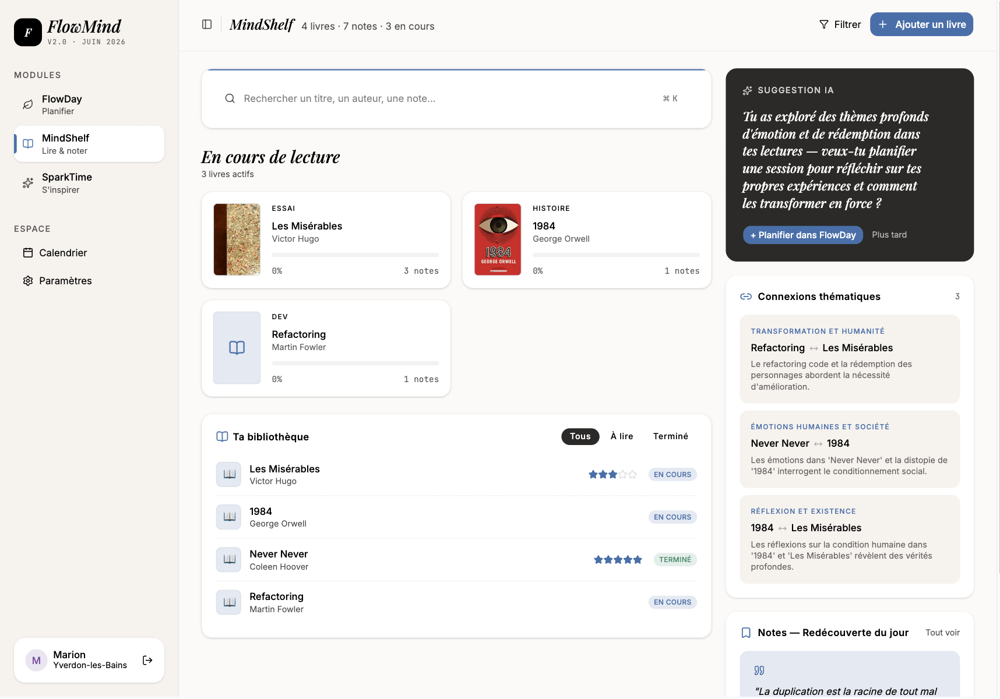
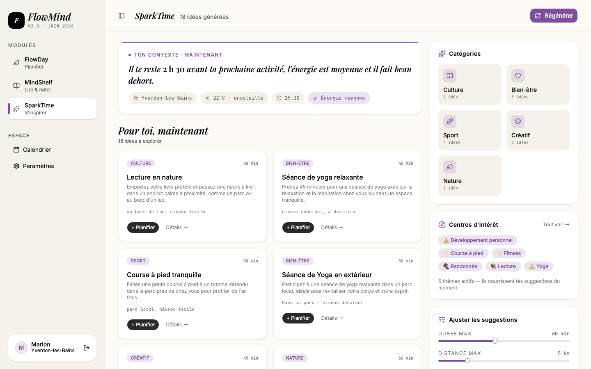
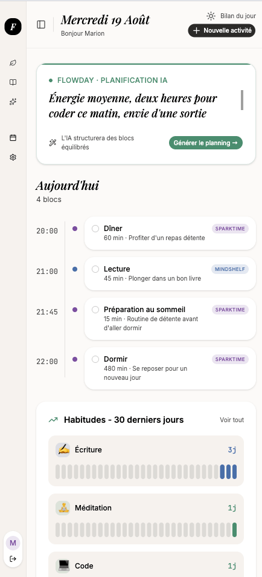

# FlowMind

**Planifie ta journée, garde une trace de tes lectures, et laisse l'IA te suggérer comment recharger — le tout dans une seule app.**

FlowMind est une application de productivité personnelle qui réunit trois modules — **FlowDay** (planification de journée assistée par IA), **MindShelf** (bibliothèque de lecture avec notes et citations) et **SparkTime** (suggestions d'activités personnalisées) — autour d'un système d'habitudes et de centres d'intérêts partagés. Projet fullstack développé en solo, du modèle de données au déploiement.

🔗 **Démo live** : [flow-mind-gamma.vercel.app](https://flow-mind-gamma.vercel.app)
_(le backend est hébergé sur un tier gratuit Railway — la toute première requête après une période d'inactivité peut prendre quelques secondes le temps que le serveur se réveille)_



---

## Aperçu

<table>
  <tr>
    <td width="50%"><br /><sub>Dashboard</sub></td>
    <td width="50%"><br /><sub>FlowDay</sub></td>
  </tr>
  <tr>
    <td width="50%"><br /><sub>MindShelf</sub></td>
    <td width="50%"><br /><sub>SparkTime</sub></td>
  </tr>
</table>


<br /><sub>Responsive mobile</sub>

---

## Les modules

### 🌱 FlowDay — Planification de journée

- Décris ta journée en langage naturel ("énergie moyenne, deux heures de code ce matin, sortie running ce soir") → l'IA (GPT-4o-mini) génère un planning structuré en blocs horaires.
- Vues Jour / Semaine / Mois avec navigation temporelle, glisser un bloc d'un jour à l'autre.
- Bilan de fin de journée généré automatiquement : titre, insight narratif, statistiques Focus/Lecture/Mouvement calculées en direct — jamais de chiffre inventé.

### 📚 MindShelf — Bibliothèque de lecture

- Ajout d'une ressource par recherche de titre ou scan ISBN via l'API OpenLibrary (gratuite, sans clé).
- Notes et citations horodatées, avec numéro de page.
- Connexions thématiques entre ressources suggérées par l'IA, mode "Redécouverte" (rotation déterministe d'anciennes notes — volontairement sans IA, pour rester gratuit et prévisible).
- Pont vers FlowDay : suggestion de créneau de lecture basée sur le rythme de la semaine.

### ✨ SparkTime — Suggestions d'activités

- Détection automatique de centres d'intérêt par IA à partir de l'activité dans les autres modules.
- Génération de suggestions filtrables par durée, distance et niveau d'énergie.
- Filtre par catégorie en un clic, planification directe dans FlowDay.

### 🔥 Habitudes

- Suivi quotidien avec grille des 30 derniers jours, streak calculé à la volée (jamais stocké — pour ne jamais désynchroniser l'affichage de la réalité).
- Partagé entre tous les modules (chaque habitude est rattachée à FlowDay, MindShelf ou SparkTime).

### Bilan hebdomadaire

Stats déterministes (Focus/Lecture/Mouvement) affichées immédiatement, synthèse narrative + actions suggérées par IA à la demande.

---

## Stack technique

| Couche          | Techno                                                     |
| --------------- | ---------------------------------------------------------- |
| Frontend        | React 18 · TypeScript · Vite · Tailwind CSS v4 · shadcn/ui |
| State           | Zustand (un store par domaine)                             |
| Routing         | React Router v6                                            |
| Backend         | Node.js · Express · TypeScript                             |
| Base de données | MongoDB Atlas + Mongoose                                   |
| Auth            | JWT + bcrypt                                               |
| IA              | OpenAI `gpt-4o-mini`                                       |
| API externe     | OpenLibrary (recherche + lookup ISBN)                      |
| Déploiement     | Vercel (frontend) · Railway (backend) · MongoDB Atlas      |

**Monorepo** : `client/`, `server/` et `shared/types.ts` (source de vérité des types métier, partagée entre front et back).

---

## Quelques décisions techniques

Une sélection de choix volontairement assumés — le détail complet est documenté dans `CLAUDE.md`.

- **Aucun champ `streak` stocké en base** : calculé à la volée depuis l'historique des habitudes, pour ne jamais risquer une désynchronisation entre la valeur affichée et la réalité.

- **Validation défensive systématique des réponses IA côté backend** — jamais de confiance aveugle dans une génération, même quand le prompt fonctionne bien en test.

- **Mode Redécouverte MindShelf sans appel IA** : rotation déterministe par jour de l'année plutôt qu'une sélection par IA — gratuit, prévisible, zéro risque d'hallucination pour une fonctionnalité qui doit juste "refaire remonter une vieille note".

- **Sections Paramètres sans base technique réelle affichées comme "Bientôt disponible"** plutôt que simulées avec de faux toggles.

- **Fonctionnalité "mot de passe oublié"** : toute la logique de sécurité (token à usage unique, hashé, expiration 1h) est réelle et testée ; l'envoi d'e-mail est pour l'instant simulé (loggé côté serveur) faute de fournisseur configuré — isolé dans une seule fonction à remplacer le jour venu.

---

## Lancer le projet en local

### Prérequis

- Node.js 18+
- Un cluster MongoDB (Atlas ou local)
- Une clé API OpenAI

### Installation

```bash
git clone git@github.com:Marionpnl/FlowMind.git
cd FlowMind

cd server && npm install
cd ../client && npm install
```

### Variables d'environnement

`server/.env` :

```
PORT=5000
MONGODB_URI=mongodb+srv://...
JWT_SECRET=<chaîne aléatoire longue>
OPENAI_API_KEY=sk-...
CLIENT_URL=http://localhost:5173
```

`client/.env` :

```
VITE_API_URL=http://localhost:5000
```

### Démarrage

```bash
# Terminal 1 — backend
cd server && npm run dev

# Terminal 2 — frontend
cd client && npm run dev
```

L'app est accessible sur `http://localhost:5173`.

---

## Structure du projet

```
flowmind/
├── client/src/
│   ├── components/     → layout, widgets partagés, un dossier par module
│   ├── pages/
│   ├── store/          → un store Zustand par domaine
│   └── lib/             → utils, dateUtils, streak, moduleStyles...
├── server/src/
│   ├── models/          → un modèle Mongoose par ressource
│   ├── routes/
│   ├── middleware/      → auth JWT
│   └── services/        → aiService (OpenAI), openLibraryService, emailService
└── shared/
    └── types.ts          → types métier partagés front/back
```

---

## Auteure

**Marion Penel** — Développeuse web fullstack, Yverdon-les-Bains (Suisse).
